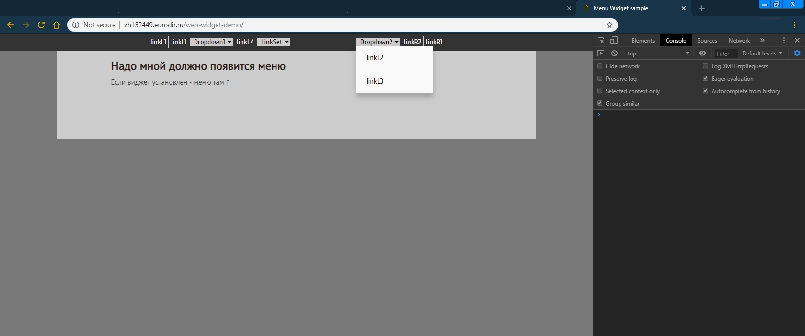

## Menu Widget with Links

Online demo: [http://vh152449.eurodir.ru/web-widget-demo](http://vh152449.eurodir.ru/web-widget-demo)

Instruction:

On the localhost:

- **npm start** 

then open browserify generated local url

On the web:

- host the **dist/assets** folder on the web
- use any your website or host the demo site (dist/index.html & dist/site-sample-assets)
- insert **widget code** in the demo

Widget code:

where

- **center** can be "true" or "false", true - will center left and right urls bars
- **theme** can be "dark" and "light", for dark and light appearance
- **left** and rigth links - put the link names and urls, also make dropdowns with links
